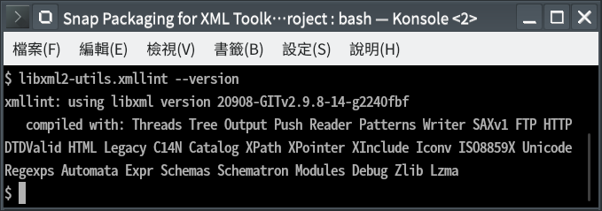

# Snap Packaging for XML Toolkit from the GNOME Project

**This is the snap for XML Toolkit from the GNOME Project**, *"XML C parser and toolkit developed for the Gnome project (but usable outside of the Gnome platform)"*. It works on Ubuntu, Fedora, Debian, and other major Linux distributions.

Published for  with 💝 by Snapcrafters

## Installation
([Don't have the `snap` command installed?](https://snapcraft.io/docs/core/install))

    # Install Snap #
    sudo snap install libxml2-utils
    
    # Connect the Snap to Optional Interfaces #
    ## `removable-media`: For accessing XML files in removable media storage devices ##
    sudo snap connect libxml2-utils:removable-media

## Exposed Commands
* `libxml2-utils.xmllint` as `xmllint`
* `libxml2-utils.xmlcatalog` as `xmlcatalog`

## What is Working
* `libxml2-utils.xmllint --help`
* `libxml2-utils.xmlcatalog --help`
* `libxml2-utils.xmllint --format`

## What is NOT Working...yet 
Nothing so far.

## What is NOT Tested...yet
Everything not mentioned in the "What is Working" section.

## Support
* Report issues regarding using this snap to the issue tracker:  
  <https://github.com/GNOME/libxml2/issues>
* You may also post on the Snapcraft Forum, under the `snap` topic category:  
  <https://forum.snapcraft.io/c/snap>

